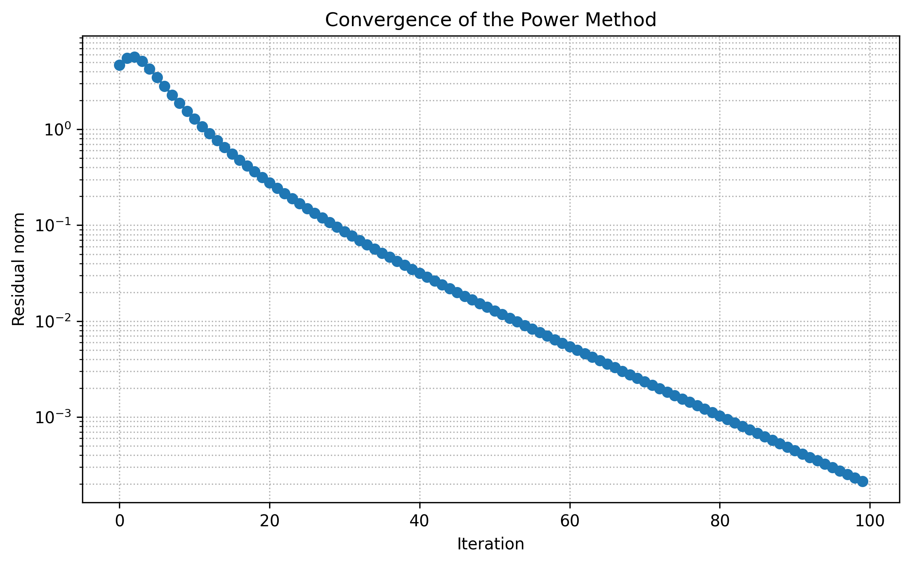
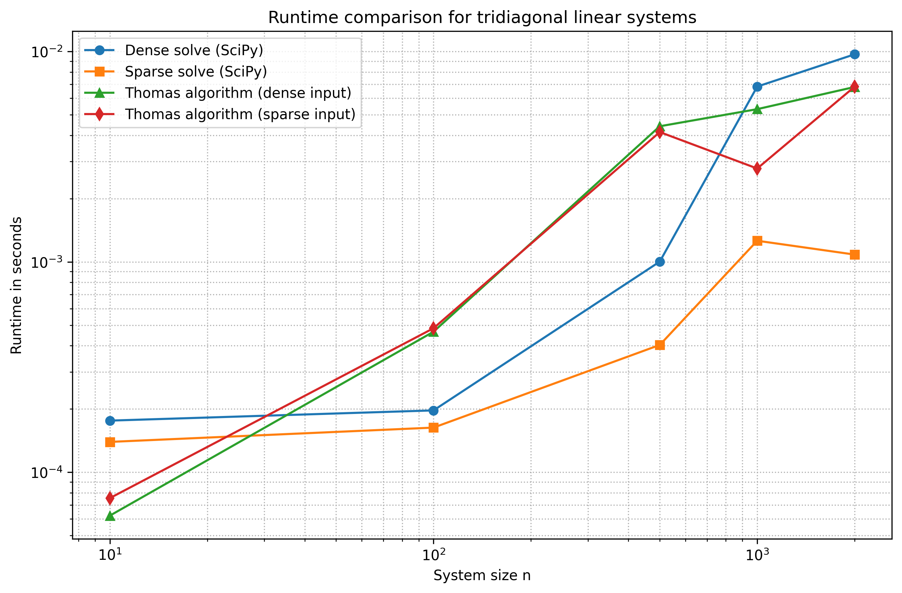
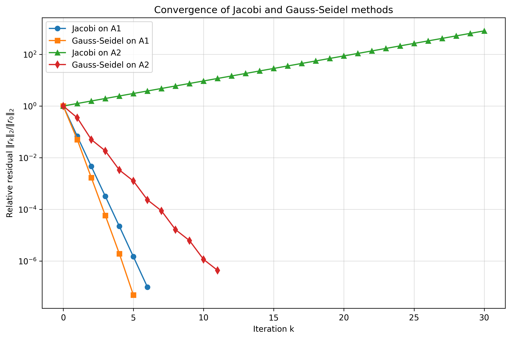
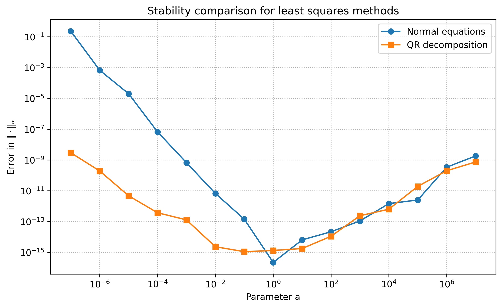
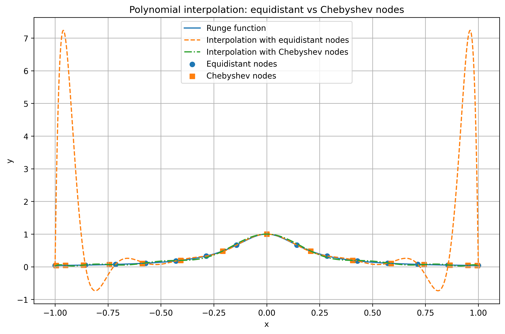

# Numerical Methods with Python

Example result: convergence of the power method



## Overview

This repository contains a collection of **Jupyter notebooks implementing classical algorithms from numerical linear algebra and scientific computing**.

The project focuses on studying **efficient numerical algorithms**, comparing different computational approaches, and analyzing their:

* runtime behaviour
* numerical stability
* convergence properties

All experiments are implemented in **Python** using the scientific computing ecosystem:

* **NumPy**
* **SciPy**
* **Matplotlib**
* **Jupyter Notebook**

The repository serves as both a **learning project** and a **demonstration of numerical algorithm implementations**.

---

# Topics Covered

The repository includes implementations and experiments for several fundamental numerical methods.

## 1. Tridiagonal Linear Systems

* Implementation of the **Thomas algorithm**
* Comparison with **dense linear solvers**
* Comparison with **sparse solvers**
* Runtime benchmarking

---

## 2. Iterative Methods

* **Jacobi method**
* **Gauss–Seidel method**
* Convergence analysis
* Performance comparison

---

## 3. Least Squares Problems

* Solving least squares via **normal equations**
* Solving least squares via **QR decomposition**
* Analysis of **numerical stability**

---

## 4. Polynomial Interpolation

* **Lagrange interpolation**
* **Newton interpolation**
* Comparison of **equidistant nodes vs. Chebyshev nodes**
* Visualization of interpolation behaviour

---

## 5. Eigenvalue Computation

* **Power method**
* **Rayleigh quotient**
* Analysis of convergence behaviour for dominant eigenvalues

---

# Example Results

## Tridiagonal Linear Systems

Runtime comparison between the **Thomas algorithm** and general-purpose solvers.



---

## Iterative Methods

Convergence comparison of **Jacobi** and **Gauss–Seidel** methods.



---

## Least Squares

Stability comparison between solving least squares problems via:

* **normal equations**
* **QR decomposition**



---

## Polynomial Interpolation

Comparison of polynomial interpolation using:

* **equidistant nodes**
* **Chebyshev nodes**



---

## Eigenvalue Computation

Convergence behaviour of the **power method** when approximating dominant eigenvalues.


---

# Repository Structure

```
numerical-methods-python
│
├── notebooks
│   ├── 01_tridiagonal_systems.ipynb
│   ├── 02_iterative_methods.ipynb
│   ├── 03_least_squares.ipynb
│   ├── 04_polynomial_interpolation.ipynb
│   └── 05_eigenvalues.ipynb
│
├── images
│   ├── tridiagonal_runtime_comparison.png
│   ├── iterative_methods_convergence.png
│   ├── least_squares_stability.png
│   ├── polynomial_interpolation_comparison.png
│   └── power_method_convergence.png
│
├── README.md
└── requirements.txt
```

---

# Installation

To run the notebooks locally, install the required Python packages:

```bash
pip install -r requirements.txt
```

---

# Requirements

The project uses the following Python libraries:

* **NumPy**
* **SciPy**
* **Matplotlib**
* **Jupyter Notebook**

---

# Learning Goals

This project demonstrates:

* implementation of **classical numerical algorithms**
* comparison of **different numerical approaches**
* analysis of **runtime complexity**
* investigation of **numerical stability**
* visualization of **algorithm convergence**

The repository supports understanding of **core techniques used in scientific computing and numerical linear algebra**.

---

# Author

**Jan Momberg**

